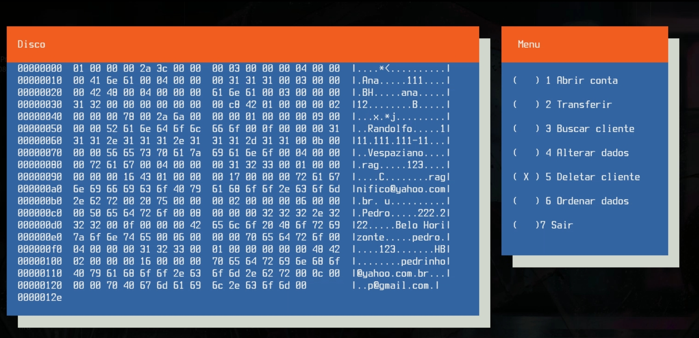
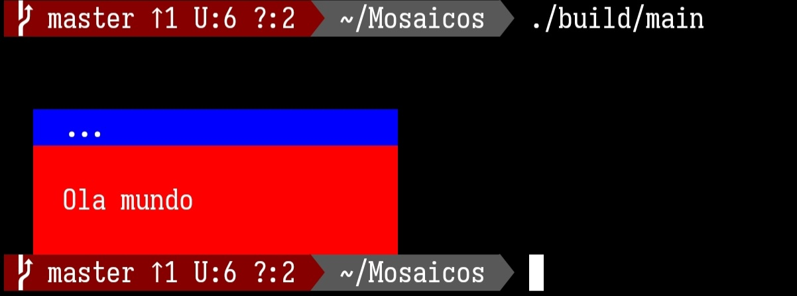

Bem vindo ao Projeto Mosaicos
=============================

   Mosaicos é uma biblioteca cross-plataforma que visa oferecer um conjunto de ferramentas 
para facilitar o uso do recursos de terminal como sintaxe highlight e coloração de 
backgrounds e foregrounds, através de objetos que simulam o comportamento destes componentes 
____________



Mosaicos dispõe dos seguintes recursos
--------------------------------------

+ Suporte a exibição de mais de 16.000 mil cores.
+ Criar displays de conteúdo textual.
+ Movimentar a posição do ponteiro de leitura do terminal.
+ Simular teoria das cores com mistura e remoção de tons.

Download
========
O código fonte de mosaicos esta disponivel em [donwload](https://gitlab.com/Randolfo-15/Mosaicos.git)

Método de compilação
--------------------

Visando maximizar a utilização da biblioteca usamos o cmake para construir a mesma
seguindo os seguintes passos:

1. Com o git clone o repositório:
``` git
git clone https://gitlab.com/Randolfo-15/Mosaicos.git
```

2. Crie um diretório para construir a biblioteca:
``` cmake
cmake -B build
```

Por padrão geramos uma biblioteca estática com este comando:

3. Caso queira gerar um biblioteca dinâmica use:
```cmake
cmake -B build -DSHARED_LIBRARY=ON
```
4. Instalação:
``` cmake
cmake --install build 
```
5. Após estes passos faça um hello_world:

``` c++
#include <Dp/display_rag.hpp>
#include <iostream>

using std::cout;

int main(){
   Dp dp;
   dp.title("...");
   dp.write("\nOla mundo\n");
   cout<<dp<<'\n';
   return 0;
}

```

### Saída:
____________

____________
Obs
===

Para mais detalhes e dúvidas consulte nosso documentação em seu browser favorito:

ex: A parte do diretório de construção da biblioteca com seu navegador faça: 
___
``` 
google ./doc/html/index.html

```


